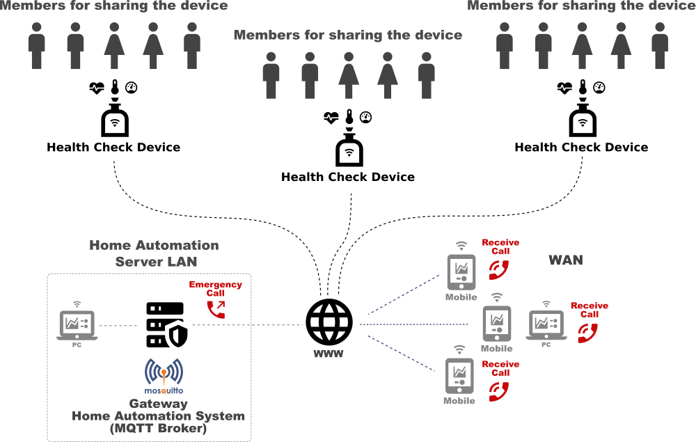
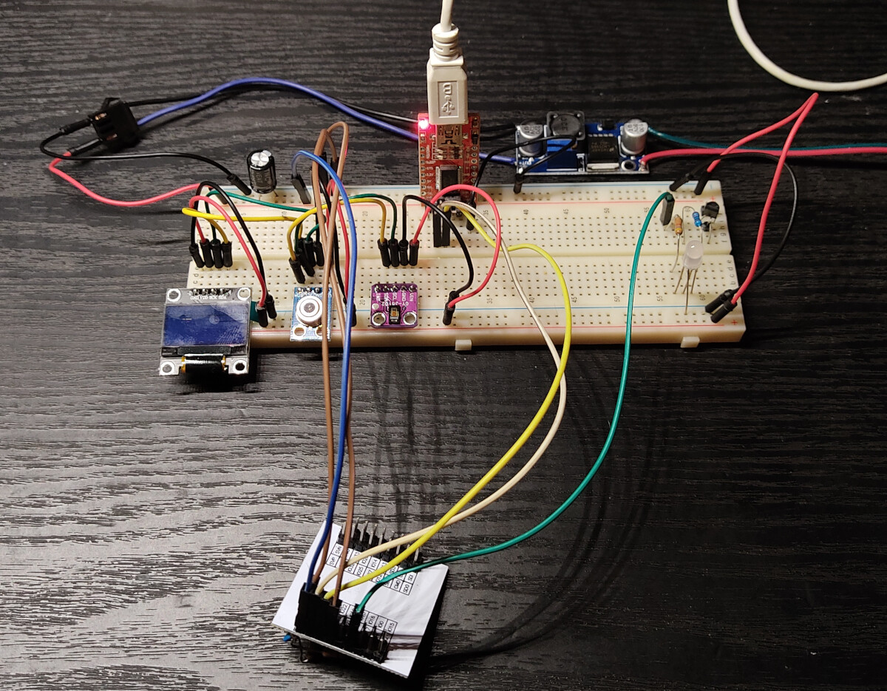
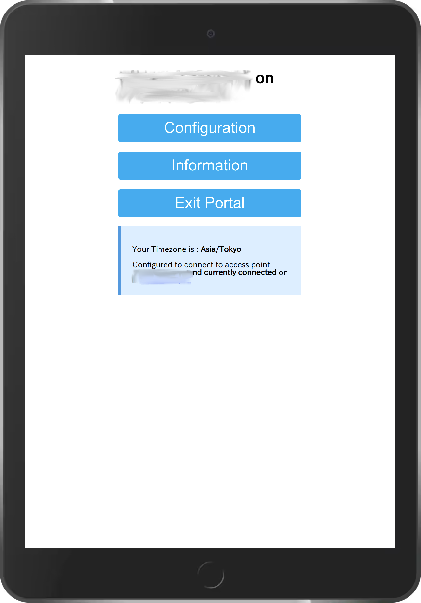
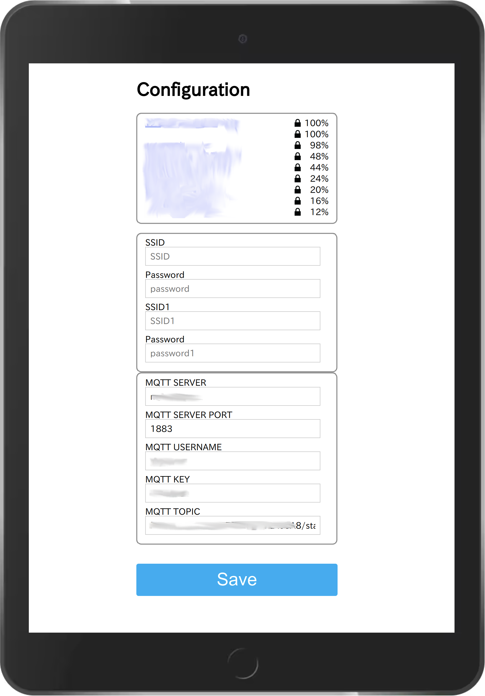
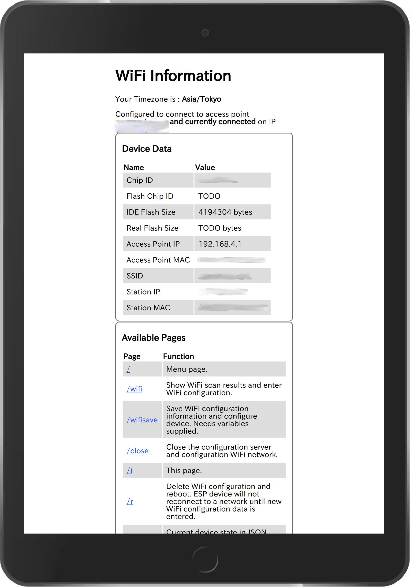

# Health Check Device for measuring Heart Rate(HR), SpO2 and Body Temperature

## Each Data is published and sent to the MQTT Server(Home Automation System) by JSON format.



## Test Components

  + Microcomputer : ESP32S
  + Pulse Oximeter : MAX30102
  + Object Temperature Sensor : GY-906 MLX90614
  + OLED : 2-color,128X64 I2C SSD1306
  + Serial Communication : 3.3V 5V FT232RL USB to TTL Serial Converter Adapter Module for Arduino
  + Converter : DC-DC Buck Converter Step Down Module LM2596 Power Supply Output 1.25V-30V
  + SDK : VS Code + platformIO, Arduino IDE



## Libraries(platformio.ini)

  + adafruit/Adafruit GFX Library@^1.10.10
	+ adafruit/Adafruit MQTT Library@^2.4.0
	+ bblanchon/ArduinoJson@^6.18.0
	+ adafruit/Adafruit MLX90614 Library@^1.1.1
	+ sparkfun/SparkFun MAX3010x Pulse and Proximity Sensor Library@^1.1.1
	+ adafruit/Adafruit BusIO@^1.7.5
	+ mathertel/OneButton@0.0.0-alpha+sha.eb583d713a
	+ khoih.prog/ESP_WifiManager@^1.7.2
	+ adafruit/Adafruit SSD1306@^2.4.6


## Important!

https://github.com/sparkfun/SparkFun_MAX3010x_Sensor_Library/issues/17#issuecomment-843191546

You need to modify the following file to meet MAX30102 register(No need to modify if you will adopt MAX30100).
`PlatformIO/Projects/esp32_max30102_mlx90614_wifi/.pio/libdeps/esp32dev/SparkFun MAX3010x Pulse and Proximity Sensor Library/src/MAX30105.cpp`

**Changed;**
> LED1 < — > LED2
> sense.red < — > sense.IR

```
.....
.....
void MAX30105::setPulseAmplitudeRed(uint8_t amplitude) {
  writeRegister8(_i2caddr, MAX30105_LED2_PULSEAMP, amplitude);
}

void MAX30105::setPulseAmplitudeIR(uint8_t amplitude) {
  writeRegister8(_i2caddr, MAX30105_LED1_PULSEAMP, amplitude);
}
.....
.....
.....
while (toGet > 0)
      {
        sense.head++; //Advance the head of the storage struct
        sense.head %= STORAGE_SIZE; //Wrap condition

        byte temp[sizeof(uint32_t)]; //Array of 4 bytes that we will convert into long
        uint32_t tempLong;

        //Burst read three bytes - RED
        temp[3] = 0;
        temp[2] = _i2cPort->read();
        temp[1] = _i2cPort->read();
        temp[0] = _i2cPort->read();

        //Convert array to long
        memcpy(&tempLong, temp, sizeof(tempLong));
		
		tempLong &= 0x3FFFF; //Zero out all but 18 bits

        sense.IR[sense.head] = tempLong; //Store this reading into the sense array

        if (activeLEDs > 1)
        {
          //Burst read three more bytes - IR
          temp[3] = 0;
          temp[2] = _i2cPort->read();
          temp[1] = _i2cPort->read();
          temp[0] = _i2cPort->read();

          //Convert array to long
          memcpy(&tempLong, temp, sizeof(tempLong));

		  tempLong &= 0x3FFFF; //Zero out all but 18 bits
          
		  sense.red[sense.head] = tempLong;
        }
.....
```


## Development Process

Please refer to the following forum site to check the development process(sorry, Japanese only):
https://ficus-forum.myvnc.com/t/topic/409/16


## Running Sequence

0. Keeping Switch on for a while and release it, ESP32 will be changed to AP Mode, enabled to access from your mobile or PC, then register SSID, Passowrd, MQTT Server and so on.

  

  

  

1. Put your finger upon MAX30102 and MLX90614 sensors position.

2. Automatically start measuring HR, Blue LED will be active on/off repeatedly, then display the values(average and final fixed values) on OLED Display.

3. Keep your finger putting on, start measuring SpO2, Green LED will be active on/off repeatedly, then display the values(SpO2 % and HR values) on OLED Display.

4. Finally, measuring your finger temperature, display the values(Actual Temp and Ambient) on OLED Display. If you want to mesure the only body temperature, release your finger at the above process 1 or 2.

5. Published JSON format data like the below to MQTT Server.
```
{"hr":66,"spo2":98,"temp":36.35}
{"hr":64,"spo2":100,"temp":36.67}
{"hr":67,"spo2":99,"temp":36.85}
```

## Cooperation with Home Automation System(how to cook data)
Data from this device will be sent to my Home Assistant MQTT server, and if under the following conditions, 
automatically call to someone registered as SIP user for notifying the emergency event.

Example conditions for emergency call;
+ HR over 100 bpm
+ SpO2 under 90 %
+ Temperature : over 38.0 ℃

Multi users of data having this device are monitored on my Home Assistant System.


## Notes
If you are developing on Arduino IDE, change the file name `main.cpp` to `file_name_you_like.ini`.
